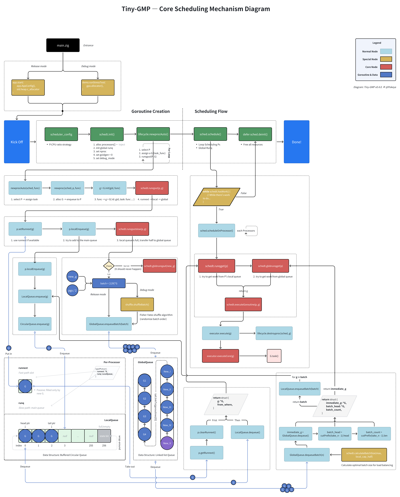

# Tiny GMP

A minimal implementation of **Go's GMP scheduler model** in Zig for educational purposes. Learn how **goroutine scheduling** works by building it from scratch.


[](https://ziglang.org/download/)


## 🚀 Quick Start

Requires [Zig **0.14.1**](https://ziglang.org/download/) (exact version; Zig syntax changes frequently).

```bash
git clone https://github.com/pokeyaro/tiny-gmp
cd tiny-gmp
zig build run  # Debug demo: runs the stress test
```

> **Note (Release mode)**
>
> Release builds call the production API, but `main.zig` intentionally sets `task_functions = null` as a placeholder and will error.
>
> To run a production build, pass your own tasks to `app.start(...)` or modify `main.zig`.

## 🎉 What’s New in v0.4.0

### 🌍 Stable Global Runqueue & Batch Intake

- Introduces a **global run queue** coordinating all Ps.
- **Batch intake** from global → local to reduce contention.
- Keeps local fast-path (`runnext` + `runq`); predictable, observable behavior.
- _Goal:_ Demonstrate **global scheduling** layered on the local-only model.

## ✨ Features (current)

> Single-threaded educational model; no wakeups, no work-stealing, no preemption (yet).

- G (goroutine) with lifecycle: `Ready → Running → Done`
- P (processor) with `runnext` fast path + local run queue
- Global run queue with batch distribution into local queues
- Deterministic demo output & debug prints for education

## 🧱 Architecture

Current architecture for **v0.4.0** — designed for clarity and step-by-step learning (will evolve in future versions):

```bash
src/
├── examples/                      # Demo applications and stress tests
│   ├── demo.zig                   # Comprehensive scheduler demonstration
│   └── tasks.zig                  # Simulated workload functions for testing
│
├── lib/
│   ├── algo/
│   │   └── shuffle.zig            # Fisher-Yates shuffling for debug randomization
│   └── ds/
│       ├── circular_queue.zig     # High-performance fixed-capacity queue
│       └── linkedlist_deque.zig   # Doubly-linked deque (Historical, deprecated — file comments explain the original design rationale)
│
├── runtime/                       # Core GMP scheduler implementation
│   ├── app.zig                    # Application runtime orchestration
│   ├── config/
│   │   └── scheduler_config.zig   # Processor scaling strategies & configuration
│   ├── core/
│   │   ├── executor.zig           # Goroutine execution engine (minimal hooks)
│   │   ├── lifecycle.zig          # Goroutine creation, scheduling, and cleanup
│   │   └── scheduler.zig          # Main scheduling algorithms and work distribution
│   ├── entity/
│   │   ├── goroutine.zig          # Goroutine (G) state management
│   │   └── processor.zig          # Processor (P) with local queue and runnext
│   └── queue/
│       ├── global_queue.zig       # Global scheduler queue with batch operations
│       └── local_queue.zig        # Per-processor queue with overflow handling
│
└── main.zig                       # Entry point with debug/release mode selection
```

## 📊 Scheduling Flow (v0.4.0)

Below is the end-to-end flow for **tiny-gmp v4**, covering both creation and execution phases:



## 🖥️ Example Output

```text
=== Tiny-GMP V4 - STRESS TEST ===

=== Creating 10000 Goroutines (Testing Overflow Logic) ===

=== Scheduler Configuration ===
Platform: Apple Silicon macOS
CPU Cores: 10
Strategy: 1:2 (P=CPU/2)
Processors: 5 (1:2 scaling)
===============================

Scheduler initialized with 5 processors
Created G1 with task1
Created G2 with task2
Created G3 with task3
Created G4 with task4
Created G5 with task5
Created G6 with task6
Created G7 with task7
Created G8 with task8
Created G9 with task9
Created G10 with task10
... creating goroutines G11 to G9990 ...
Transferred 129 goroutines from P0 to global queue
Transferred 129 goroutines from P1 to global queue
Transferred 129 goroutines from P2 to global queue
Transferred 129 goroutines from P3 to global queue
Transferred 129 goroutines from P4 to global queue
```

See full run in [docs/outputs/example-v0.4.0.txt](./docs/outputs/example-v0.4.0.txt)

## 📜 Version History

### v0.4.0 — Global Runqueue Online

_“Stable runqueues & batch intake.“_

- **Features**: global runq; batch intake; local overflow to global; debug-first behavior.
- **Design Boundaries**: no work-stealing; no idle-aware wakeups; cooperative (non-preemptive).
- **Goal**: bridge per-P scheduling with system-wide coordination.

### v0.3.0 — Local Runqueues Only + Modular Architecture

_“Per-P scheduling with runnext fast path, no global handoff; refactored into modular files.”_

- **Features**: modular layout (`core/`, `entity/`, `queue/`, `lib/ds/`); `LocalQueue` on `CircularQueue`; `WorkItem` origin tracing; `assignTasksCustom`; stepwise rounds.
- **Design Boundaries**: no global runq; no work-stealing/wakeups; no preemption/time-slice.
- **Goal**: solidify local-only model; prepare interfaces for global queue.

### v0.2.0 — Per-P Local Runqueues (runnext + circular runq)

_“Multiple Ps with per-P circular queues and a runnext fast path; round-robin assignment; no global queue.”_

- **Features**: P with `runnext` + circular `runq`; round-robin assign; dequeue prioritizes `runnext`; one G per round for traceability.
- **Design Boundaries**: no global runq / batch intake / spill; no work-stealing/wakeups; one-shot tasks.
- **Goal**: establish **per-P semantics** and the **`runnext` fast path**.

### v0.1.0 — Single-Threaded Fixed Queue

_“Single loop over a fixed G array; no P, no queues.“_

- **Features**: fixed `[3]G` one-shot tasks; scan → first `.Ready` → run → `.Done`; one G per cycle.
- **Design Boundaries**: no P; no local/global run queues; no work-stealing.
- **Goal**: establish the **G lifecycle** and the **minimal mental model**.

## 🛣️ Roadmap

- **v0.5.0** — Idle-Aware Wakeups
- **v0.6.0** — Work Stealing
- **v0.7.0** — Time-slice / Yield

Long-term: align closer with Go runtime's GMP while keeping code educational and minimal.

## 📚 License

MIT License - see [LICENSE](./LICENSE) file for details.

---

_Learn by building. Understand by doing. Master by teaching._
