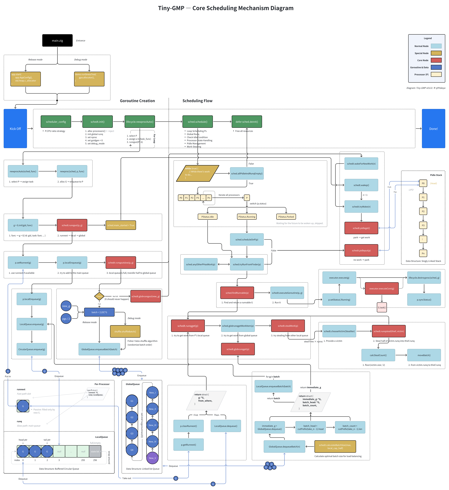

# Tiny GMP

A minimal implementation of **Go's GMP scheduler model** in Zig for educational purposes. Learn how **goroutine scheduling** works by building it from scratch.


[](https://ziglang.org/download/)


## 🚀 Quick Start

Requires [Zig **0.14.1**](https://ziglang.org/download/) (exact version; Zig syntax changes frequently).

```bash
git clone https://github.com/pokeyaro/tiny-gmp
cd tiny-gmp
zig build run  # Debug demo: runs the stress test
```

> **Note (Release mode)** \
> Release builds call the production API, but `main.zig` intentionally sets `task_functions = null` as a placeholder and will error. \
> To run a production build, pass your own tasks to `app.start(...)` or modify `main.zig`.

## 🎉 What’s New in v0.6.0

**Core theme:** introduce **work-stealing** with clear victim scanning and capacity checks.

- **Work-stealing loop**: each idle P attempts up to `stealTries × nproc` victim scans per steal attempt.

- **Victim selection**:

  - Randomized starting index (`cheapRandIndex`).

  - Ring scan order, skipping `thief` itself.

  - Iteration stops after one full round.

- **Capacity-aware stealing**:

  - Skip victim if thief’s local run queue is full.

  - Skip victim if it has no runnable work.

- **Steal operation**:

  - Steal **half** of victim’s run queue (capped by thief’s available capacity).

  - **No** `runnext` **stealing** — intentionally simpler than Go’s runtime.

  - Batch-move with defensive capacity checks.

- **Refactor**:

  - `refactor(scheduler)`: **unify work finding into** `findRunnable` — integrates global queue intake and stealing into a single, consistent path.

## ✨ Features (current)

> Single-threaded, educational build; **no work-stealing**, **no preemption** (yet). \
> Now with **deterministic work-stealing** and integrated work-finding logic.

- G (goroutine) with lifecycle: `Ready → Running → Done`
- P (processor) with `runnext` fast path + local run queue
- Global run queue with **batch intake** into local queues
- **Local overflow → global** with **immediate wakeups**
- **Pidle stack** with `PStatus.{Running, Idle, Parked}`
- **Work-stealing** with random start & capacity-based victim selection
- Deterministic demo output & rich debug prints

## 🧱 Architecture

Current architecture for **v0.6.0** — designed for clarity and step-by-step learning (will evolve in future versions):

```bash
src/
├── examples/                      # Demo applications and stress tests
│   ├── demo.zig                   # Comprehensive scheduler demonstration
│   └── tasks.zig                  # Simulated workload functions for testing
│
├── lib/
│   ├── algo/
│   │   ├── random.zig             # Lightweight random helpers
│   │   └── shuffle.zig            # Fisher-Yates shuffling for debug randomization
│   └── ds/
│       ├── circular_queue.zig     # High-performance fixed-capacity queue
│       └── linkedlist_deque.zig   # Doubly-linked deque
│
├── runtime/                       # Core GMP scheduler implementation
│   ├── app.zig                    # Application runtime orchestration
│   ├── config/
│   │   └── scheduler_config.zig   # Processor scaling strategies & configuration
│   ├── core
│   │   ├── executor.zig           # Goroutine execution engine (minimal hooks)
│   │   ├── lifecycle.zig          # Goroutine creation, scheduling, and cleanup
│   │   └── scheduler/             # Main scheduling algorithms and work distribution
│   │       ├── basics.zig
│   │       ├── ctor.zig
│   │       ├── display.zig
│   │       ├── find_work.zig
│   │       ├── loop.zig
│   │       ├── mod.zig
│   │       ├── pidle_ops.zig
│   │       ├── runner.zig
│   │       ├── runq_global_ops.zig
│   │       ├── runq_local_ops.zig
│   │       └── steal_work.zig
│   ├── gmp/
│   │   ├── goroutine.zig          # Goroutine (G) state management
│   │   └── processor.zig          # Processor (P) with local queue and runnext
│   ├── queue/
│   │   ├── global_queue.zig       # Global scheduler queue with batch operations
│   │   └── local_queue.zig        # Per-processor queue with overflow handling
│   └── tg.zig                     # Umbrella module for stable internal imports
│
└── main.zig                       # Entry point with debug/release mode selection
```

## 🏗 Design Philosophy

Tiny-GMP is not just an implementation — it's a step-by-step exploration of Go’s GMP scheduler model. Each feature is designed with clarity, traceability, and educational value in mind.

See [docs/design](./docs/design/en/) for detailed design notes, including:

```bash
docs/design/
├── go-idle-p-lifo.md
├── linkedlist-deque-history.md
├── runnext-passive-replenishment.md
└── work-stealing-strategy.md
```

## 📊 Scheduling Flow (v0.6.0)

Below is the end-to-end flow for **tiny-gmp v6**, covering both creation and execution phases:



## 🖥️ Example Output

```text
=== Tiny-GMP V6 - STRESS TEST ===
...
--- Round 2001 ---
[steal] P0 scan(start=1): P1 -> P2 -> P3 -> P4 -> P0(skip) (all empty)
[pidle] +P0 (idle=1)
[steal] P1 scan(start=4): P4 -> P0 -> P1(skip) -> P2 -> P3 (all empty)
[pidle] +P1 (idle=2)
[steal] P2 scan(start=4): P4 -> P0 -> P1 -> P2(skip) -> P3 (all empty)
[pidle] +P2 (idle=3)
[steal] P3 scan(start=3): P3(skip) -> P4 -> P0 -> P1 -> P2 (all empty)
[pidle] +P3 (idle=4)
[steal] P4 scan(start=2): P2 -> P3 -> P4(skip) -> P0 -> P1 (all empty)
[pidle] +P4 (idle=5)
All processors idle and no work, scheduler stopping

=== Final Status ===
...

=== Stress Test Completed Successfully ===
```

See full run in [docs/outputs/example-v0.6.0.txt](./docs/outputs/example-v0.6.0.txt).

## 📜 Version History

See full history in [CHANGELOG.md](./CHANGELOG.md).

## 🛣️ Roadmap

- **v0.7.0** — Time-slice / Yield

Long-term: align closer with Go runtime's GMP while keeping code educational and minimal.

## 📚 License

MIT License - see [LICENSE](./LICENSE) file for details.

---

_Learn by building. Understand by doing. Master by teaching._
