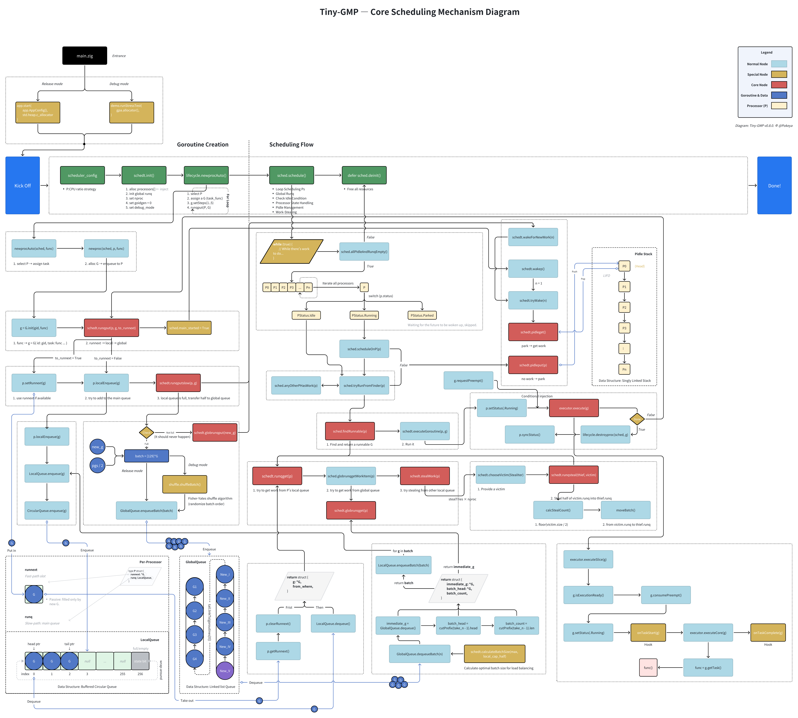

# Tiny GMP

A minimal implementation of **Go's GMP scheduler model** in Zig for educational purposes. Learn how **goroutine scheduling** works by building it from scratch.


[](https://ziglang.org/download/)


## 🚀 Quick Start

Requires [Zig **0.14.1**](https://ziglang.org/download/) (exact version; Zig syntax changes frequently).

```bash
git clone https://github.com/pokeyaro/tiny-gmp
cd tiny-gmp
zig build run  # Debug demo: runs the stress test
```

> **Note (Release mode)** \
> Release builds call the production API, but `main.zig` intentionally sets `task_functions = null` as a placeholder and will error. \
> To run a production build, pass your own tasks to `app.start(...)` or modify `main.zig`.

## 🎉 What’s New in v0.8.0

**Core theme:** introduce **safe-point preemption** so the scheduler can cut in before a task call.

- **Safe-point preemption:** `G.requestPreempt()` sets a flag; `G.consumePreempt()` checks & clears it at the call boundary; if set, we **don’t call the task** and requeue at **local tail** via `runqputTailWithReason(.Preempt)`.
- **Execution layering kept:** `execute → executeSlice → executeCore`; the preemption check lives in `executeSlice` right before calling `executeCore`.
- **Diagnostics:** `YieldReason` enum + per-G `last_yield_reason` with `getLastYieldReason()/Str()` helpers; debug sampling hook `(gid % 29 == 0)` to inject observable preempts.
- **Refactor/consistency:** `Self` receivers in G/P, added `P.getStatus`, and a reasoned enqueue wrapper `runqputTailWithReason()` (tags + logs) without changing `runqput` semantics.
- **Cleanup:** removed v7 `step/quantum` scaffolding.

## ✨ Features (current)

> Single-threaded, educational build; **safe-point preemption** at task call boundaries; no arbitrary-point/signal preemption; single M.

- G (goroutine) with lifecycle: `Ready → Running → Done`
- P (processor) with `runnext` fast path + local run queue
- Global run queue with **batch intake** into local queues
- **Local overflow → global** with **immediate wakeups**
- **Pidle stack** with `PStatus.{Running, Idle, Parked}`
- **Work-stealing** with randomized victim scan & capacity checks
- **Safe-point preemption** (`requestPreempt/consumePreempt`), tail re-enqueue with reason tagging
- Deterministic demo output & debug prints

## 🧱 Architecture

Current architecture for **v0.8.0** — designed for clarity and step-by-step learning (will evolve in future versions):

```bash
src/
├── examples/                      # Demo applications and stress tests
│   ├── demo.zig                   # Comprehensive scheduler demonstration
│   └── tasks.zig                  # Simulated workload functions for testing
│
├── lib/
│   ├── algo/
│   │   ├── random.zig             # Lightweight random helpers
│   │   └── shuffle.zig            # Fisher-Yates shuffling for debug randomization
│   └── ds/
│       ├── circular_queue.zig     # High-performance fixed-capacity queue
│       └── linkedlist_deque.zig   # Doubly-linked deque
│
├── runtime/                       # Core GMP scheduler implementation
│   ├── app.zig                    # Application runtime orchestration
│   ├── config/
│   │   └── scheduler_config.zig   # Processor scaling strategies & configuration
│   ├── core
│   │   ├── executor.zig           # Goroutine execution engine (minimal hooks)
│   │   ├── lifecycle.zig          # Goroutine creation, scheduling, and cleanup
│   │   └── scheduler/             # Main scheduling algorithms and work distribution
│   │       ├── basics.zig
│   │       ├── ctor.zig
│   │       ├── display.zig
│   │       ├── find_work.zig
│   │       ├── loop.zig
│   │       ├── mod.zig
│   │       ├── pidle_ops.zig
│   │       ├── runner.zig
│   │       ├── runq_global_ops.zig
│   │       ├── runq_local_ops.zig
│   │       └── steal_work.zig
│   ├── gmp/
│   │   ├── goroutine.zig          # Goroutine (G) state management
│   │   └── processor.zig          # Processor (P) with local queue and runnext
│   ├── queue/
│   │   ├── global_queue.zig       # Global scheduler queue with batch operations
│   │   └── local_queue.zig        # Per-processor queue with overflow handling
│   └── tg.zig                     # Umbrella module for stable internal imports
│
└── main.zig                       # Entry point with debug/release mode selection
```

## 🏗 Design Philosophy

Tiny-GMP is not just an implementation — it's a step-by-step exploration of Go’s GMP scheduler model. Each feature is designed with clarity, traceability, and educational value in mind.

See [docs/design](./docs/design/en/) for detailed design notes, including:

```bash
docs/design/
├── go-idle-p-lifo.md
├── linkedlist-deque-history.md
├── runnext-passive-replenishment.md
└── work-stealing-strategy.md
```

## 📊 Scheduling Flow (v0.8.0)

Below is the end-to-end flow for **tiny-gmp v8**, covering both creation and execution phases:



## 🖥️ Example Output

```text
=== Tiny-GMP V8 - STRESS TEST ===
...
--- Round 6 ---
P0: Executing G9046 (from runq)
  -> Database query: `SELECT * FROM users;`
P0: G9046 done
P1: Executing G9047 (from runq)
  -> HTTP GET request to 'api.example.com'
P1: G9047 done
P2: Executing G9048 (from runq)
[yield] P2: G9048 (Preempt) -> tail
...
--- Round 195 ---
P0: Executing G9106 (from runq)
  -> Database query: `SELECT * FROM users;`
P0: G9106 done
P1: Executing G9077 (from runq)
  -> Vite: Triggering hot module replacement for App.vue
P1: G9077 done
P2: Executing G9048 (from runq)
  -> Image processing: resize 1920x1080 -> 640x480
P2: G9048 done
...
```

See full run in [docs/outputs/example-v0.8.0.txt](./docs/outputs/example-v0.8.0.txt).

## 📜 Version History

See full history in [CHANGELOG.md](./CHANGELOG.md).

## 🛣️ Roadmap

- **v0.9.0** — Park/Unpark + Timer-Driven Preemption

Long-term: align closer with Go runtime's GMP while keeping code educational and minimal.

## 📚 License

MIT License - see [LICENSE](./LICENSE) file for details.

---

_Learn by building. Understand by doing. Master by teaching._
