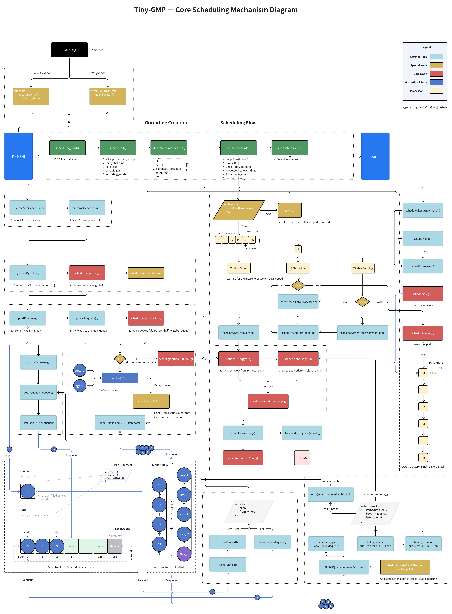

# Tiny GMP

A minimal implementation of **Go's GMP scheduler model** in Zig for educational purposes. Learn how **goroutine scheduling** works by building it from scratch.


[](https://ziglang.org/download/)


## 🚀 Quick Start

Requires [Zig **0.14.1**](https://ziglang.org/download/) (exact version; Zig syntax changes frequently).

```bash
git clone https://github.com/pokeyaro/tiny-gmp
cd tiny-gmp
zig build run  # Debug demo: runs the stress test
```

> **Note (Release mode)** \
> Release builds call the production API, but `main.zig` intentionally sets `task_functions = null` as a placeholder and will error. \
> To run a production build, pass your own tasks to `app.start(...)` or modify `main.zig`.

## 🎉 What’s New in v0.5.0

**Core theme:** make idle Ps _really_ sleep and be woken on demand.

- **Pidle stack (LIFO)**: processors are explicitly parked on a stack.
- **`PStatus.Parked`** replaces the old `on_idle_stack` flag.
- **State-driven loop**: `switch (p.status)` → `.Parked` (skip), `.Idle` (try global once → park), `.Running` (local→global→park).
- **Wakeups**:

  - `globrunqput` and **`runqputslow`** now call `wakeForNewWork(k)` → `tryWake(min(k, npidle))`.
  - `wakep()` is a thin wrapper of `tryWake(1)`.

- **Safe park semantics**: never double-push the same P; `pidleput/pidleget` maintain `npidle` correctly.
- **Clean exit**: loop stops when `runq.isEmpty()` **and** `npidle == nproc`.

## ✨ Features (current)

> Single-threaded, educational build; **no work-stealing**, **no preemption** (yet). \
> Now with **idle-aware wakeups**.

- G (goroutine) with lifecycle: `Ready → Running → Done`
- P (processor) with `runnext` fast path + local run queue
- Global run queue with **batch intake** into local queues
- **Local overflow → global** with **immediate wakeups**
- **Pidle stack** with `PStatus.{Running, Idle, Parked}`
- Deterministic demo output & rich debug prints

## 🧱 Architecture

Current architecture for **v0.5.0** — designed for clarity and step-by-step learning (will evolve in future versions):

```bash
src/
├── examples/                      # Demo applications and stress tests
│   ├── demo.zig                   # Comprehensive scheduler demonstration
│   └── tasks.zig                  # Simulated workload functions for testing
│
├── lib/
│   ├── algo/
│   │   ├── random.zig             # Lightweight random helpers
│   │   └── shuffle.zig            # Fisher-Yates shuffling for debug randomization
│   └── ds/
│       ├── circular_queue.zig     # High-performance fixed-capacity queue
│       └── linkedlist_deque.zig   # Doubly-linked deque
│
├── runtime/                       # Core GMP scheduler implementation
│   ├── app.zig                    # Application runtime orchestration
│   ├── config/
│   │   └── scheduler_config.zig   # Processor scaling strategies & configuration
│   ├── core
│   │   ├── executor.zig           # Goroutine execution engine (minimal hooks)
│   │   ├── lifecycle.zig          # Goroutine creation, scheduling, and cleanup
│   │   └── scheduler              # Main scheduling algorithms and work distribution
│   │       ├── basics.zig
│   │       ├── ctor.zig
│   │       ├── display.zig
│   │       ├── find_work.zig
│   │       ├── loop.zig
│   │       ├── mod.zig
│   │       ├── pidle_ops.zig
│   │       ├── runner.zig
│   │       ├── runq_global_ops.zig
│   │       └── runq_local_ops.zig
│   ├── gmp/
│   │   ├── goroutine.zig          # Goroutine (G) state management
│   │   └── processor.zig          # Processor (P) with local queue and runnext
│   ├── queue/
│   │   ├── global_queue.zig       # Global scheduler queue with batch operations
│   │   └── local_queue.zig        # Per-processor queue with overflow handling
│   └── tg.zig                     # Umbrella module for stable internal imports
│
└── main.zig                       # Entry point with debug/release mode selection
```

## 📊 Scheduling Flow (v0.5.0)

Below is the end-to-end flow for **tiny-gmp v5**, covering both creation and execution phases:



## 🖥️ Example Output

```text
=== Tiny-GMP V5 - STRESS TEST ===
...
--- Round 2001 ---
[pidle] +P0 (idle=1)
[pidle] +P1 (idle=2)
[pidle] +P2 (idle=3)
[pidle] +P3 (idle=4)
[pidle] +P4 (idle=5)
All processors idle and no work, scheduler stopping

=== Final Status ===
P0: 0 tasks remaining
P1: 0 tasks remaining
P2: 0 tasks remaining
P3: 0 tasks remaining
P4: 0 tasks remaining
Idle processors: [5/5]
Pidle stack: P4(head) -> P3 -> P2 -> P1 -> P0

=== Stress Test Completed Successfully ===
```

See full run in [docs/outputs/example-v0.5.0.txt](./docs/outputs/example-v0.5.0.txt)

## 📜 Version History

### v0.5.0 — Idle-Aware Wakeups

_“Make sleep/wake first-class.”_

- **Features**: `PStatus {Running, Idle, Parked}`; strict **pidle** push/pop; unified **wakep/tryWake** + **wakeForNewWork** (global enqueue & local overflow); state-driven `schedule()` with early-exit; `displayPidle` debug.

- **Design Boundaries**: single-threaded; no Ms/stealing/preemption; wake only on global work signals.

- **Goal**: correct sleep/wake semantics, lay groundwork for multi-M and work-stealing.

### v0.4.0 — Global Runqueue Online

_“Stable runqueues & batch intake.“_

- **Features**: global runq; batch intake; local overflow to global; debug-first behavior.
- **Design Boundaries**: no work-stealing; no idle-aware wakeups; cooperative (non-preemptive).
- **Goal**: bridge per-P scheduling with system-wide coordination.

### v0.3.0 — Local Runqueues Only + Modular Architecture

_“Per-P scheduling with runnext fast path, no global handoff; refactored into modular files.”_

- **Features**: modular layout (`core/`, `gmp/`, `queue/`, `lib/ds/`); `LocalQueue` on `CircularQueue`; `WorkItem` origin tracing; `assignTasksCustom`; stepwise rounds.
- **Design Boundaries**: no global runq; no work-stealing/wakeups; no preemption/time-slice.
- **Goal**: solidify local-only model; prepare interfaces for global queue.

### v0.2.0 — Per-P Local Runqueues (runnext + circular runq)

_“Multiple Ps with per-P circular queues and a runnext fast path; round-robin assignment; no global queue.”_

- **Features**: P with `runnext` + circular `runq`; round-robin assign; dequeue prioritizes `runnext`; one G per round for traceability.
- **Design Boundaries**: no global runq / batch intake / spill; no work-stealing/wakeups; one-shot tasks.
- **Goal**: establish **per-P semantics** and the **`runnext` fast path**.

### v0.1.0 — Single-Threaded Fixed Queue

_“Single loop over a fixed G array; no P, no queues.“_

- **Features**: fixed `[3]G` one-shot tasks; scan → first `.Ready` → run → `.Done`; one G per cycle.
- **Design Boundaries**: no P; no local/global run queues; no work-stealing.
- **Goal**: establish the **G lifecycle** and the **minimal mental model**.

## 🛣️ Roadmap

- **v0.6.0** — Work Stealing
- **v0.7.0** — Time-slice / Yield

Long-term: align closer with Go runtime's GMP while keeping code educational and minimal.

## 📚 License

MIT License - see [LICENSE](./LICENSE) file for details.

---

_Learn by building. Understand by doing. Master by teaching._
